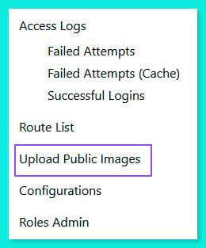
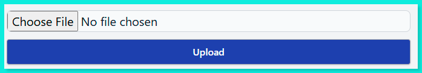

<p align="center"><a href="https://www.yusaini-usulludin.info/" target="_blank">
    
</a></p>


# A simple incidence/case management System for a small and medium size companies

This Application is designed with a small and medium-size company in mind that doesn't need a complex or complicated incidence/case management system. It is open source, hence no enterpise style licensing is required to run it. Built using a standard Laravel/Livewire framework and MySQL.

## [1] About the Application

It is simple and intuitive. The application focuses on the whole lifecycle of the incident/case management process, from the point when the incidence/case is raised, the handling of it which involves customer, team and personnel interaction, to its resolution and closure. The key idea is transparency, visibility and efficiency in moving the incidence/case from one stage to another preventing the risk of being missed or left stagnant.

## [2] Main Features

- [Status Dashboard](https://www.yusaini-usulludin.info/#dashboard): provides a summary of all incidences/cases status currently in progress
- [Incidence/Case List](https://www.yusaini-usulludin.info/#ticketCaseIncidence):  with intuitive tabs that provide easy access to incidences/cases lists based on their status with search facility
- [Incidence/Case Profile](https://www.yusaini-usulludin.info/#incidenceProfile): provides all the required information and actions of the selected incidence/case together with facilities to move it forward, for example, progress action, progress log timeline, resolution etc.,
- [Incidence/Case Event Calendar](https://www.yusaini-usulludin.info/#incidenceCalendar): provides a calendar view of events relating to outstanding incidences/cases, for example, respond-by, breach, scheduled visits etc.,
- [Customer Site List](https://www.yusaini-usulludin.info/#customerList): provides the list of customer sites, with search facility and a quick view of a type of a site (Main or Child). If a site is a child, its parent (Main) will be specified.
- [Customer Site Profile](https://www.yusaini-usulludin.info/#customerProfile): provides customer site profile information, which include, amongst others, list of assets, associated service level agreement, contacts, site document folder, and a create incidence/case facility etc.,
- [Customer Portal](https://www.yusaini-usulludin.info/#customerPortal): it provides the ability for admin with specific privileges to enable and disable customer portal.
- [Products](https://www.yusaini-usulludin.info/#productList) and [Supplier](https://www.yusaini-usulludin.info/#supplierList) lists: every site can be associated to products and Products can be associated to suppliers. Therefore, the App provides the facility to create list of products and suppliers. Products linked to a site are called assets.
- [Service Level Agreement](https://www.yusaini-usulludin.info/#serviceLevelAgreement): this feature makes it easy to apply a Service Level Agreement which forms a contract of service to customer site. Create a template of SLA then apply it to more than one sites with customisation. A site can have more than one SLA.
- [User, Role & Permission Management](https://www.yusaini-usulludin.info/#userRoles):  it provides user and role management. Role can be created and associated with users. Configuration of permission will depend on the roles, hence users based on their roles will have access to certain pages that are specified by the roles.
- The Ability to [import](https://www.yusaini-usulludin.info/#fileImportExample) and [export](https://www.yusaini-usulludin.info/#fileExportExample) data: it provides the ability to import and export selected data using excel .xls format.

## [3] Installation/Deployment Requirements

This notes assume that the deployment/installation will be on Linux (tested on Ubuntu 24.x). Make sure the requirements below are in place ..

- composer
- PHP >= 8.2 (for this app we are using 8.4)
- node >= 8
- npm >= 11

To install the latest composer follow this [steps-by-steps tutorial](https://www.digitalocean.com/community/tutorials/how-to-install-composer-on-ubuntu-22-04-quickstart). 

To install npm and nodejs on Ubuntu go to this [tutorial](https://www.digitalocean.com/community/tutorials/how-to-install-node-js-on-ubuntu-22-04).

Check also [nvm](https://github.com/nvm-sh/nvm) to manage nodejs.

To upgrade to PHP 8.4 follow this [tutorial](https://php.watch/articles/php-84-install-upgrade-guide-debian-ubuntu)


## [4] To install and Test

STEP 1: Make sure to install the required PHP extensions for composer install to work.

```
$ sudo apt install -y php-cli php-mbstring php-xml php-bcmath php-curl php-zip php-gd php-intl php-mysql unzip
```

STEP 2: Clone the Application in the directory of your choosing

```
$ git clone https://github.com/YusainiU/Project-STEPS.git <your-directory-name>
```

STEPS 3: Change directory to your-directory-name

```
$ cd <your-directory-name>
```

STEP 4: Execute ...

```
your-directory-name$ composer install
```

STEP 5: Then execute ...

```
your-directory-name$ npm install
your-directory-name$ npm run build
```

STEP 6: Copy .env.example to .env

```
your-directory-name$ ls --all
your-directory-name$ copy .env.example .env
```

STEP 7: Open the file .env and make the necessary changes, for example ..

```
	APP_TIMEZONE=Europe/London
	APP_FAKER_LOCALE=en_GB
	DB_PASSWORD=password
	TICKET_MONIKER = 'Case'
	TICKET_MONIKER_PLURAL = 'Cases'   
```

STEP 8: Then generate the application key ...

```
your-directory-name$ php artisan key:generate
```

STEP 9: Run migrate to create all the tables for the application ..

```
your-directory-name$ php artisan migrate
```

STEP 10: Then seed the tables. This will create a required administrator roles, and temporary administrator account for initial access.

```
your-directory-name$ php artisan db:seed
```

> [!NOTE]
> The inital account to access the application is username: admin@admin.com and password: password

> [!WARNING]
> Make sure to change the account email address and password

STEP 11: To use the file upload facilities, make sure to link the storage ..

```
your-directory-name$ php artisan storage:link
```

STEP 12: You can now test the application ..

```
your-directory-name$ composer run dev
```

## [5] To Deploy

This is a manual deploy on Ubuntu >= 22.x with the same specs as Install above.

You can follow this tutorial to install and configure [Apache Web Server](https://www.digitalocean.com/community/tutorials/how-to-install-the-apache-web-server-on-ubuntu-22-04)

Make sure the <ins>**requirements specified in [3]**</ins> are in place and <ins>**steps 1 in [4]**</ins> has been executed.

STEP 1: Install and enable the FastCGI Process Manager (FPM) for PHP 8.4

```
$ sudo service apache2 stop
$ sudo apt install php8.4-fpm
$ sudo a2enconf php8.4-fpm
$ sudo service apache2 start  
```

STEP 2: Make sure to allow Apache in the server firewall configuration. If you are using UFW ...

```
$ sudo ufw allow 'Apache Full'
$ sudo ufw delete allow 'Apache'
```

STEPS 3: Change ownership of /var/www

We are using /var/www directory on Ubuntu to deploy the application.

Make sure that you have sufficient permission to run git, composer and php artisan commands inside /var/www

Let assume the user is 'userAdmin'. Grant the user and webserver (www-data) ownership ..

```
$ sudo chown -R userAdmin:www-data /var/www
```

STEPS 4: Then the permissions ...

```
$ sudo chmod -R g+sw /var/www
```

STEPS 5: Now you have sufficient permission, you can clone the application inside /var/www

```
$ cd /var/www
$ git clone https://github.com/YusainiU/Simple-Incidence-Management.git <your-directory-name>
```

STEPS 6: Next ...

```
$ cd <your-directory-name>
$ composer install
$ npm install
$ npm run build
```

STEPS 7: Copy env.example to .env, and make the necessary changes, for example ..

```
	APP_TIMEZONE=Europe/London
	APP_FAKER_LOCALE=en_GB
	DB_PASSWORD=password
	TICKET_MONIKER = 'Case'
	TICKET_MONIKER_PLURAL = 'Cases'    
```

STEPS 8: Now generate the app key

```
$ php artisan key:generate
```

STEPS 9: Next, run migration

```
$ php artisan migrate
```

STEPS 10: Seed the database

```
$ php artisan db:seed
```

STEPS 11: To use storage (for uploading files for example)

```
$ php artisan link:storage
```

STEPS 12: Next, we need to change the ownership and permissions of files and folders to enable the webserver (Apache) to serve the request

1. Make sure to add the current user (userAdmin) to the webserver group.

```
    $ sudo usermod -a -G www-data <userAdmin>
```

2. Give the webserver ownership to the application root directory 'your-directory-name'

```
    $ sudo chown -R www-data:www-data /var/www/<your-directory-name>
```

3. Then change the files and folders permission 

```
    $ sudo find /var/www/<your-directory-name> -type f -exec chmod 644 {} \;
    $ sudo find /var/www/<your-directory-name> -type d -exec chmod 755 {} \;
```

4. This Optional but highly recommended. Grant the userAdmin necessary permissions and ownership to all files and folders

```
	$ cd <your-directory-name>
	$ sudo chown -R <userAdmin>:www-data .
    $ sudo find . -type f -exec chmod 664 {} \;
	$ sudo find . -type d -exec chmod 775 {} \;
```

5. Lastly, give the webserver (www-data) read and write permissions to storage and cache folders

```
	$ sudo chgrp -R www-data storage bootstrap/cache
    $ sudo chmod -R ug+rwx storage bootstrap/cache
```

STEPS 13: Apache Configurations

The next step is to create a virtual host file. This guide is for a simple virtual hosting on port 80 for testing purposes. For a more secured implementation, follow this [tutorial](https://www.digitalocean.com/community/tutorials/how-to-secure-apache-with-let-s-encrypt-on-ubuntu), on how to use https (SSL Encryption) using certbot Let's Encrypt.

>[!WARNING]
>It is important to secure your public Web Server with the SSL Encryption

1. Create a .conf file for your application

```
    $ cd /etc/apache2/sites-available
    $ vim your-application-name.conf

    ** Add this sample config and save **

			<virtualHost *:80>

				DocumentRoot /var/www/your-directory-name/public
			
				<Directory /var/www/your-directory-name>
				
					Options -Indexes +FollowSymLinks
					AllowOverride All
					Require all granted
				
				</Directory

				# Log Files
				ErrorLog ${APACHE_LOG_DIR}/error.log
				CustomLog ${APACHE_LOG_DIR}/access.log combined

			</VirtualHost>

    ** End Config **
```

2. Then execute these ..

```
	$ sudo a2enmod rewrite
	$ sudo a2dissite <disable all default .conf>
	$ sudo a2ensite your-application-name.conf    
```

3. Restart Apache webserver

```
    $sudo service apache2 restart
```

## [6] To change the logo

1. Open the application and login as Administrator

2. Click Admin Page next to logged-in User name


3. In the Admin Page click Upload Public Image



4. Upload your preferred logo for the app.



5. Edit the config file ..

```
config/steps.php

Change logo-1.png to the file name of the image you uploaded..

    /*--------------------------------------------------------------------------
    | Logo
    |--------------------------------------------------------------------------
    */

    'logo_path' => 'storage/public_images/logo-1.png',

```

